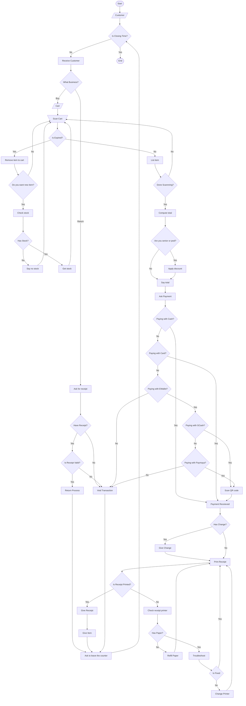

# Cashier Flowchart

This flowchart is a visual representaion of a work of a cashier in a convience store. The code will be uploaded soon.

```mermaid
flowchart
    start([Start])
    customer[/Customer/]
    receive_customer[Receive Customer]
    ask_business{What Business?}
    cart[/Cart/]
    scan_cart[\Scan Cart/]
    is_expired{Is Expired?}
    remove_item[Remove item to cart]
    want_new{Do you want new item?}
    check_stock[Check stock]
    has_stock{Has Stock?}
    no_stock[Say no stock]
    get_stock[Get stock]
    list_items[List item]
    done_scan{Done Scannning?}
    is_discounted{Are you senior or pwd?}
    compute_total[Compute total]
    say_total[Say total]
    ask_pay[Ask Payment]
    cash{Paying with Cash?}
    card{Paying with Card?}
    ewallet{Paying with EWallet?}
    void[Void Transaction]
    ask_leave[Ask to leave the counter]
    discount[Apply discount]
    print_receipt[Print Receipt]
    pay_receive[Payment Receieved]
    is_receipt_out{Is Receipt Printed?}
    has_change{Has Change?}
    give_change[Give Change]
    give_receipt[Give Receipt]
    give_items[Give Item]
    gcash{Paying with GCash?}
    paymaya{Paying with Paymaya?}
    scan_qr[Scan QR code]
    refill[Refill Paper]
    check[Check receipt printer]
    has_paper{Has Paper?}
    troubleshoot[Troubleshoot]
    is_fixed{Is Fixed}
    change_printer[Change Printer]
    is_closing{Is Closing Time?}
    ask_receipt[Ask for receipt]
    has_receipt{Have Receipt?}
    is_receipt_valid{Is Receipt Valid?}
    process_return[Return Process]
    endt([End])
    


    start --> customer
    customer --> is_closing
    is_closing -- Yes --> endt
    is_closing -- No --> receive_customer
    receive_customer --> ask_business
    ask_business -- Buy --> cart
    ask_business -- Return --> ask_receipt
    ask_receipt --> has_receipt
    has_receipt -- No --> void
    has_receipt -- Yes --> is_receipt_valid
    is_receipt_valid -- No --> void
    is_receipt_valid -- Yes --> process_return
    process_return --> ask_leave
    cart --> scan_cart
    scan_cart --> is_expired
    is_expired -- Yes --> remove_item
    is_expired -- No --> list_items
    list_items --> done_scan
    done_scan -- No --> scan_cart
    done_scan -- Yes --> compute_total
    compute_total --> is_discounted
    is_discounted -- No --> say_total
    is_discounted -- Yes --> discount
    discount --> say_total
    say_total --> ask_pay
    ask_pay --> cash
    cash -- No --> card
    cash -- Yes --> pay_receive
    pay_receive --> has_change
    has_change -- Yes --> give_change
    give_change --> print_receipt
    has_change -- No --> print_receipt
    print_receipt --> is_receipt_out
    is_receipt_out -- Yes --> give_receipt
    is_receipt_out -- No --> check
    check --> has_paper
    has_paper -- Yes --> troubleshoot
    troubleshoot --> is_fixed
    is_fixed -- Yes --> print_receipt
    is_fixed -- No --> change_printer
    change_printer --> print_receipt
    has_paper -- No --> refill
    refill --> print_receipt
    give_receipt --> give_items
    give_items --> ask_leave
    card -- Yes --> pay_receive
    card -- No --> ewallet
    ewallet -- No --> void
    ewallet -- Yes --> gcash
    gcash -- Yes --> scan_qr
    scan_qr --> pay_receive
    gcash -- No --> paymaya
    paymaya -- No --> void
    paymaya -- Yes --> scan_qr
    void --> ask_leave
    ask_leave --> is_closing
    remove_item --> want_new
    want_new -- No --> scan_cart
    want_new -- Yes --> check_stock
    check_stock --> has_stock
    has_stock -- No --> no_stock
    has_stock -- Yes --> get_stock
    get_stock --> scan_cart
    no_stock --> scan_cart

```