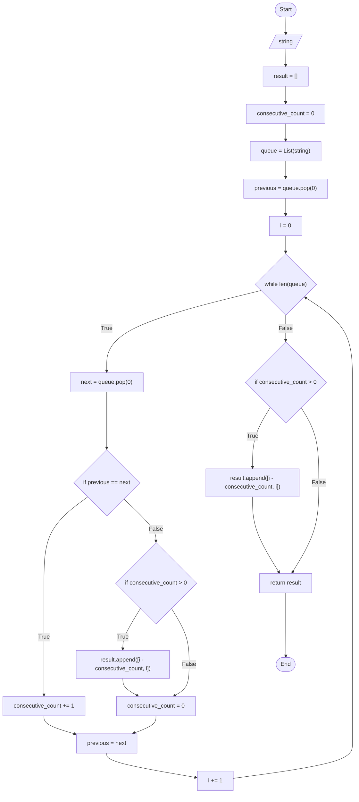

# Function 101 __[Consecutive Characters]__

Create a function that wound return the index of consecutive characters in a string.
Use `Queue Data Structures` 

### Example
* Given a string "111abccc2deff33g"
    * It should return __[[0, 2], [5, 7], [11, 12], [13, 14]]__
* Given a string "abcdef"
    * It should return __[]__

## Flowchart for this Function

