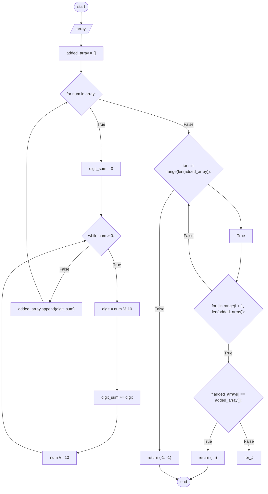

# Function 102 [Equal Sum]
Create a `flowchart` for a function that would identify the `indexes` of the `first pair` of the numbers in an array having an equal sum. 
The program must treat the `numbers` `as numbers` `not as string.`

### Example:
* Given an array of [23, 19, 41, 34, 6, 33]
    * the function should return `(0, 2)`.
* Given an array of [23, 19, 42, 34, 6, 33]
    * the function should return `(2, 4)`.
* Given an array of [43, 19, 41, 35, 6, 3]
    * the function should return `(-1, -1)`.

## Flowchart for this function

