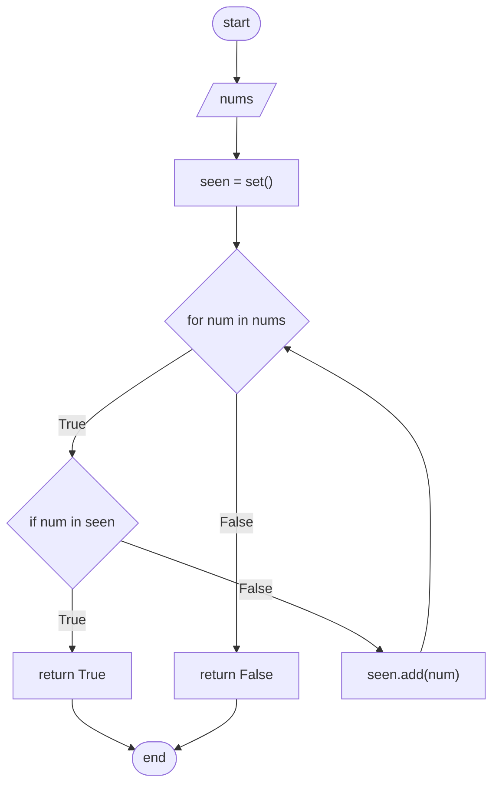

# Probem 217 - Contains Duplicate

Problem Link -> <https://leetcode.com/problems/contains-duplicate/description/>

## Flowchart

Flowchart approach in this problem

```mermaid
    flowchart TD
        start([start])
        nums[/nums/]
        seen["seen = set()"]
        loop{"for num in nums"}
        if_seen{"if num in seen"}
        true[return True]
        false[return False]
        add["seen.add(num)"]
        terminate([end])

        start --> nums -->
        seen --> loop -- True -->
        if_seen -- True --> true --> terminate
        if_seen -- False --> add
        add --> loop
        loop -- False --> false --> terminate
```