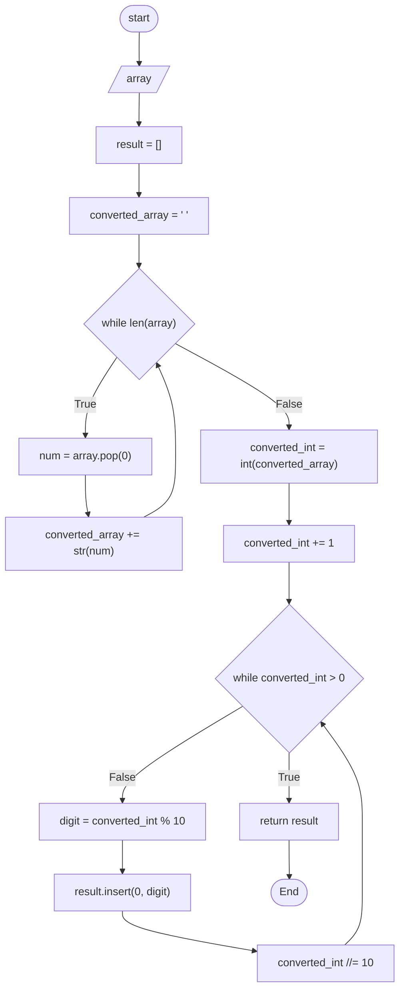

# Problem 66 - Plus One

Problem Link -> <https://leetcode.com/problems/plus-one/description/>

## Flowchart

Flowchart approach in this problem

```mermaid
    flowchart TD
        start([start])
        array[/array/]
        result["result = []"]
        converted_array["converted_array = ' '"]
        loop{"while len(array)"}
        num["num = array.pop(0)"]
        add_num_to_string["converted_array += str(num)"]
        convert_int["converted_int = int(converted_array)"]
        plus_one["converted_int += 1"]

        loop_2{"while converted_int > 0"}
        last_num["digit = converted_int % 10"]
        insert["result.insert(0, digit)"]
        remove_last_num["converted_int //= 10"]
        return["return result"]
        terminate([End])


        start --> array
        array --> result
        result --> converted_array
        converted_array --> loop
        loop -- True --> num
        num --> add_num_to_string
        add_num_to_string --> loop

        loop -- False --> convert_int
        convert_int --> plus_one
        plus_one --> loop_2

        loop_2 -- False --> last_num
        last_num --> insert
        insert --> remove_last_num
        remove_last_num --> loop_2

        loop_2 -- True --> return
        return --> terminate
```
