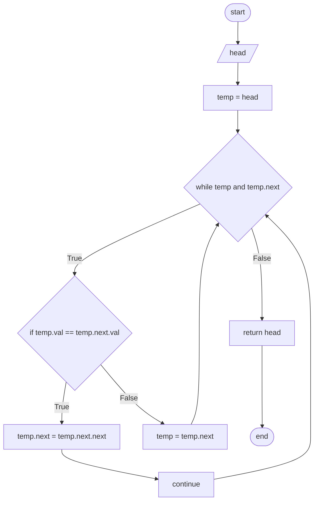

# Problem 83 - Remove Duplicates from Sorted List

Problem Link -> <https://leetcode.com/problems/remove-duplicates-from-sorted-list/description/>

## Flowchart

Flowchart approach in this problem

